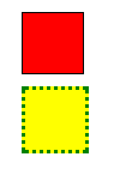
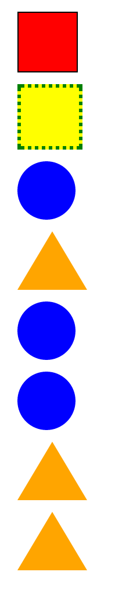

# Classes and IDs Challenge

We are going to learn a new concept for use with CSS. You won't have to write any CSS for this, I will do that part. The two most important HTML attributes to prepare you for CSS are called `class` and `id`. Stop this lesson after about 45 minutes.

### Preparation

Make a new folder on whatever computer you have access to called 'class_id'. Make an index.html file in it, with the boilerplate that we have learned. Link a css file to it, and copy in the following code

```css
div {
  margin: 10px;
  width: 50px;
  height: 50px;
}

#foo {
  background: red;
  border: 1px solid black;
}

#bar {
  background: yellow;
  border: 3px dotted green;
}

.circle {
  background: blue;
  border-radius: 50%;
}

.triangle {
  width: 0px;
  height: 0px;
  border-left: 30px solid transparent;
  border-right: 30px solid transparent;
  border-bottom: 50px solid orange;
}
```

Don't edit this code, but we are going to read it. 'foo' and 'bar' are both the names of some ids that I have referred to in the CSS. An id is denoted by the '#' before it. There is also a 'triangle' class and a 'circle' class. They are denoted by putting a dot before it.

### Using IDs

Put two divs in your code (`<div></div>`), one after the other. Make sure both your files are saved, and try loading 'index.html' in your browser. Do you see anything? No, because the divs don't have a color yet.

Lets try giving the divs ids, so that they can take on the attributes from my CSS file. Give them the ids like so:

```html
<div id="foo"></div>
<div id="bar"></div>
```

Save your work and reload the page. You should see something like this:



Wow! Even though both are divs, they took on different properties. They are being distinguished by their ids. Ids should only be used once per HTML file, they are supposed to apply to only one thing on a page.

### Classes

Sometimes we want to add attributes to more than one object on a page. That's what classes are for. Add 5 more divs to the page. Make some of them have class 'triangle' (`<div class="triangle"></div>`), and some have class 'circle' (`<div class="triangle"></div>`). It might look something like this:



Classes can be used for as many objects in a page as you wish. They can even overlap. Make sure to try at least one div with `class="triangle circle"`. Huh, that looks weird, right? What about combining classes and ids? Some combinations will work, and others wont. Try to figure out why.

### Stretch

If you feel like you know what is going on, try to make some ids and classes of your own. You can add classes to any of the tags that we have been using (p, ul, li, h1, a, img...). If you decide to do this, be sure to upload both your index file and your css file.

### Conclusion

If you ran out of time, simply upload your 'index.html' file as it is right now.
