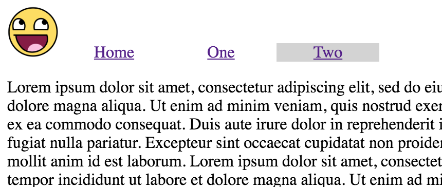

# Consistent Interfaces

Tonights homework will not be technically challenging, but instead will challenge us to think about what the user is experiencing.

When we were making our 'Choose Your Own Adventure' games, it was always a good idea to only have links to the next pages. The whole idea of a game is to try to remove you from the world, and to create actions with consequences.

This, however, is not what we want to do with our final projects. When a user clicks a link on your page, they should feel like they have just moved to another part of the same place. And they should not have to use the back button to return to where they started, it should be clear how to get back using links on the page.

### Preparation

Make three html files. One should be 'index.html', and two others should be 'one.html' and 'two.html'. Give them all a boilerplate, and link them to a 'style.css'. Copy from previous projects if that saves time. The front html page of your website should always be called 'index'. Ask me in class if you don't know why.

### Logo and Navbar

Grab a mostly square funny picture off of the internet. Store it in the same folder as your challenge. We can now create our navbar. Put this code into all three of your pages:

```html
  <ul class="topnav">
    <a id="logo" href="index.html"></a>
    <li><a href="index.html">Home</a></li>
    <li><a href="one.html">One</a></li>
    <li><a href="two.html">Two</a></li>
  </ul>
```

These links are going to be part of the consistent interface to this website. Do you notice that the logo seems to be redundant to the home button? I leave it up to you to decide whether or not to keep the home button.

### Styling

I demonstrated how to do a topnav today in class. If you need to remember though, here is some code to think about.

```css
.topnav {
  list-style-type: none;
  margin: 0;
  padding: 0;
}

.topnav li {
  width: 100px;
  display: inline-block;
  text-align: center;
}

#logo {
  width: 50px;
}
```

The `topnav` class is just there to get rid of the default ul behavior. The rule for the list items inside keeps them evenly spaced, lined up next to each other, and centered in their boxes. If something doesn't make sense to you, try looking it up on the MDN.

### Content and Visual Cues

Add some content to each of the three pages, after the navigation ul. Don't use any headers or titles yet. Would it be hard for people to tell which of the three pages they are on? Is there another way to tell them where they are?

Lets see if we can. Add this id to your stylesheet:

```css
#active {
  background: #D3D3D3;
}
```

That is a light gray background color. We are going to go into the html page and put that id on whichever link points to the page that they are on. So on the home page, one of the links would be `<li id="active"><a href="index.html">Home</a></li>`, and on the first page it would be `<li id="active"><a href="one.html">One</a></li>` etc. Fill all three in, and go to look at your page. When you are on page two, it should look something like this:



Now every page has a clear indicator of which page you are on. That indicator is in the same visual location as the link that you used to get there. This kind of simplicity is very useful in creating a good experience for the person visiting your website.

Can you think of other ways to create this kind of experience for users? Feel free to share them with the class tomorrow. Your final project does not need to have this particular kind of consistent interface, but it must be consistent in some way. I look forward to your questions.
