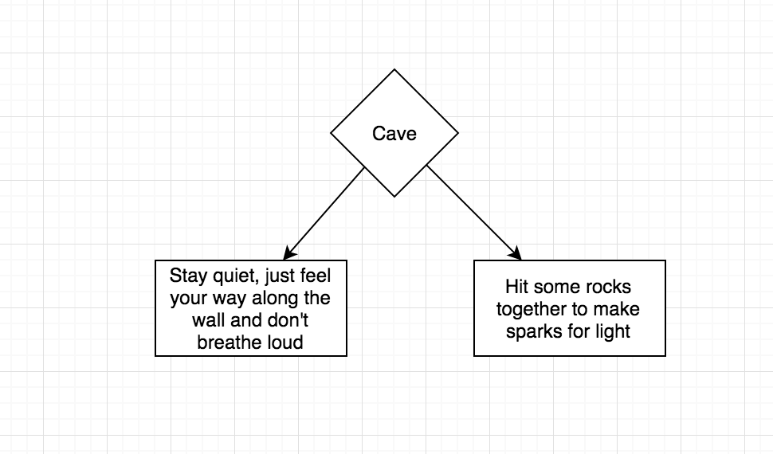
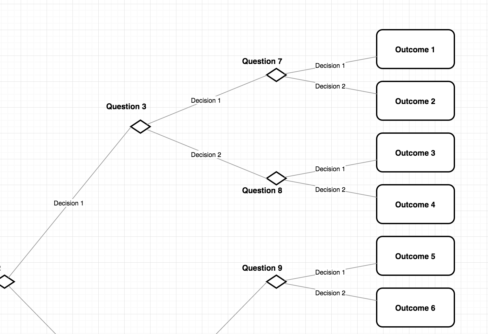

# Choose Your Own Adventure Challenge

Today is a study hall day, so I'm making this a longer challenge (~1.5 hours). As with other homework challenges, just stop and read the "Submit" section when you are out of time.

## What is a 'Choose Your Own Adventure' Game?

There was a popular childrens book series in the 80's and 90's called choose your own adventure. At the end of a chapter, the book would ask you to make a choice. Depending on your choice, you would turn to a particular page number. The story would continue on that page as if that is what actually happened. The reader could read the book again and again, since different choices made different stories.

## Planning your game

Using a sheet of paper and a pencil, design a flow chart for how your story will progress. Save the real creative writing for later, right now we are just making an outline. Here are some example images of how that might look:

 

When you are done with your plan, it's a good idea for you to assign unique numbers or names to each of the places in the flow chart. This will assist you with the next task

## Making/Linking the pages

Make a new folder on that drive called 'choose'. If you are using a thumb drive or personal computer, make sure it is on that drive or computer.

Using a text editor, create a boilerplate `index.html` file. Once that is done, make copies of this file, renaming each one to match a number or name from your flowchart eg `2.html` or `cave_back.html`.

Once the files exist, add anchor tags to each of your files, corresponding to each of the potential choices from your flow chart. Open `index.html` and make sure that all the links work before moving on to the next part.

## Making written content

You already have most of a playable story! Add creative details to draw the player in and keep their interest.

## Add images to your adventure

Plain text is a little bit boring, are you able to add images to make it more interesting? Where are those images located, on your computer or on the internet?

## Dealing with a user 'inventory'

Try to add a section of the story where the user decides to pick up an object, or not. How do you handle the flow chart, if the decision doesn't matter change events until much later? If you have gotten it to work, do you have any duplicate pages? This is a classic problem to deal with, try to imagine what kind of tools would make it easier, and write these ideas into a hidden comment on your index page.

## Submit

Upload only the index.html page to schoology. If you have a thumb drive or are working on a personal computer, be sure to remember to bring your files to class. If you are on someone elses computer, just do your best to save it for later (copy/paste?).
