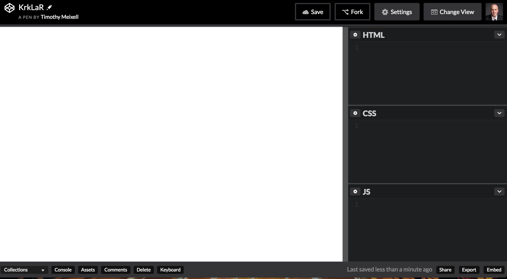
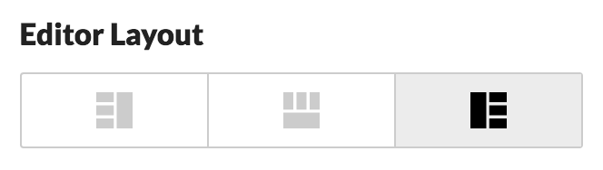

# Hello World Challenge

In this challenge, we are going to demonstrate the most basic capabilities of HTML and CSS. You'll get your first clue about what work each is meant for.

### Set-Up

Sign in to CodePen. If you still don't have an account, have someone help you set it up. Create a new pen, it should look something like this:



If the page is layed out differently, and you don't like that, click
"Change View" and make sure that "Editor Layout" is set like this:



The three boxes to the right are where you will be typing code. On the left, a view of what you are making will appear.

### HTML

For this first challenge, we will not be using any tags in our HTML. Some of you are saying "What, Why?" To learn what happens in the simplest scenario.

Type the words "Hello World" in HTML box. It should appear in the view. Where does the text appear? Is it on the top or the bottom? Is it on the left or right? Why do you think it's where it is? What font is it (guess)? If you like taking notes, write down your answers for our discussion later.

### CSS

Next we are going to write some CSS. Type the following into the CSS box:

```css
body {
  color: red;
}
```

Don't worry if you didn't know what this means yet, that's the point. The body of an html page is where all of the content lives. Normally we would have `<body>` and `</body>` tags in the html, to say where the content starts and ends. CodePen doesn't need you to, it is behaving as if you said this:

```html
<body>
  Hello World
</body>
```

Everything inside the body tags has been given the attributes that you defined in your CSS. In this case, you are saying that all text should have the color red. Try some other color names in there, be creative (no googling!). Which ones worked, and which ones didn't? Do you have a guess as to why? Does CSS actually **understand** english words like 'red'?

### Conclusion

Leave the most interesting color you were able to get to work. Click the save button at the top of your pen. Copy the URL of your pen from the browser, and submit it as your response to this challenge.

With most challenges in class, you will show your work to an instructor before moving on. Even on easy ones like this. Are you prepared to answer questions about this?
