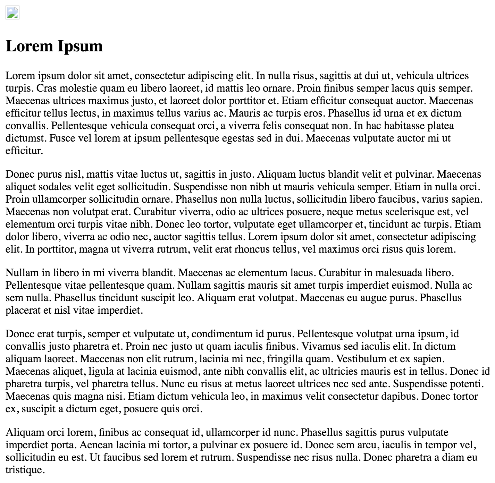
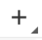
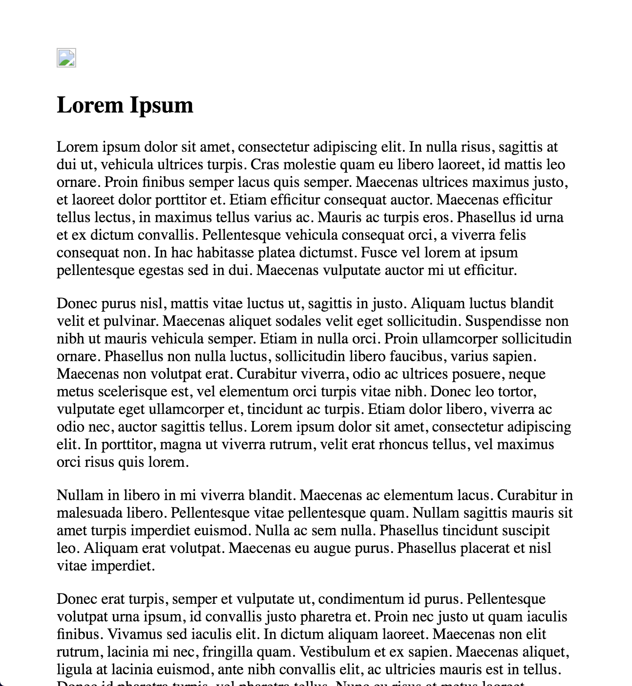
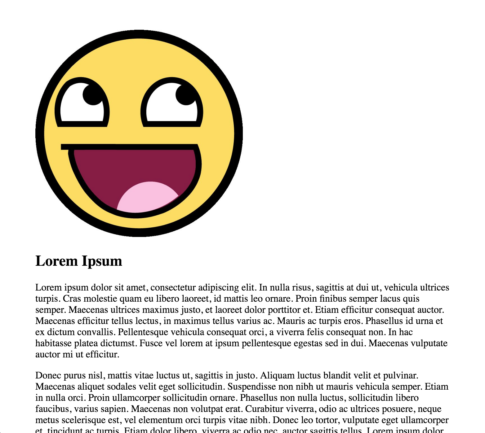
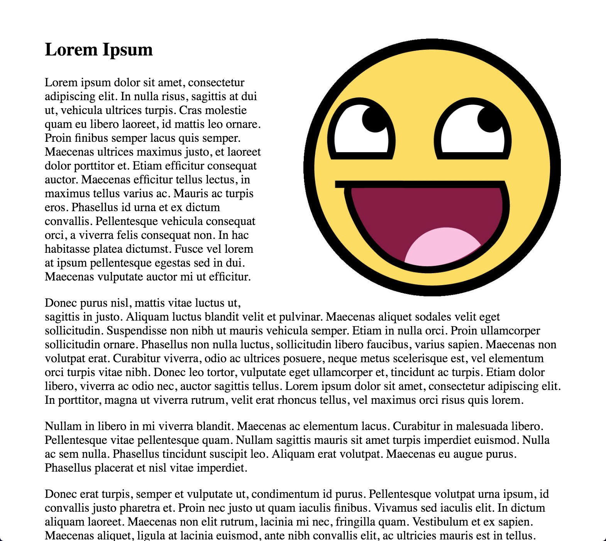
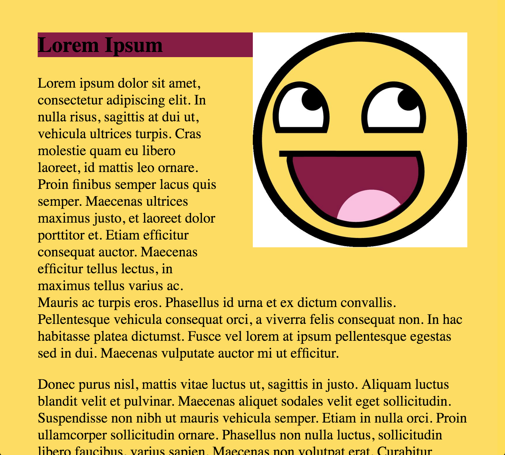
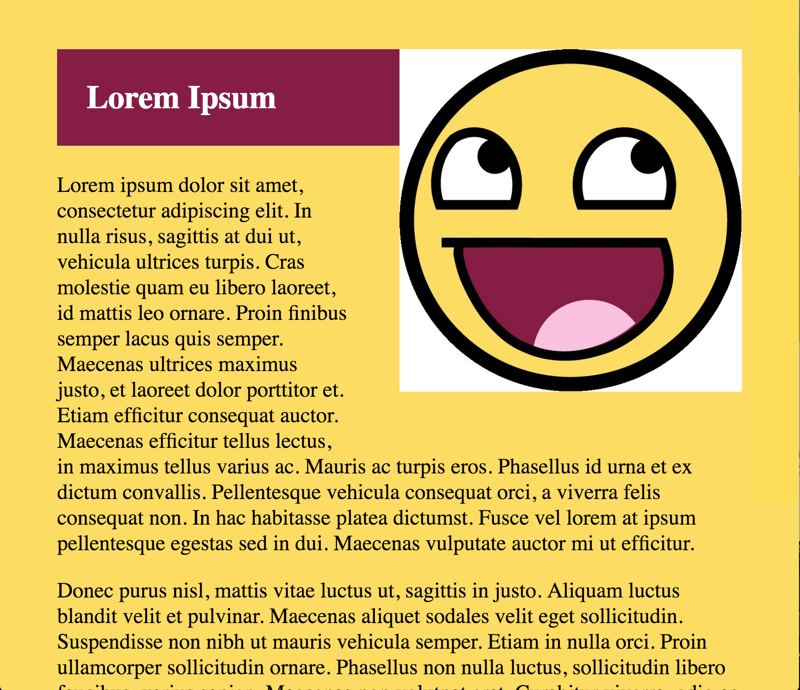

# 1st Weekend Challenge

We have started learning some real CSS, and this weekends challenge is to apply the positioning that we have been trying to learn. You can read MDN and w3schools as much as you want when completing this challenge.

### Preparation

Download the [index.html](https://gist.github.com/misternu/1e2d45f62887d966b057eb38883733d7/archive/8e63fbce58089e2a1b591e9ad9fdb6f82f8895ca.zip) file that I have prepared. Put it in a folder for this challenge, and open it in Chrome. It should look something like this:

Looks pretty boring right now, and it's hard on the user to have to run their eyes all the way across for each line that they read. Maybe there is some way that we can move everything away from the edges of the window.

### DevTools

Open Chrome's DevTools, on a Mac with Command-Option-I, on a PC with Control-Shift-I. If it is not already there, go to the elements tab of of the dev tools. By clicking through the page's elements, can you find a tag that is surrounding all of the content on the page but is inside of the `body` tag?

### Add a rule to the page

Lets experiment in the dev tools to see if we can move that element away from the edges. Click on the element, and then click on the `new style rule` button that looks like this:

Add some style attributes to the rule. What we want to change is the `margin`. Either change just that attribute, or you can be more specific ('margin-left', 'margin-top', etc). Be sure to put a unit after your value, like 'px' or 'em', so that the browser will know how much you mean.

Now the site should look like this:

### Writing our actual CSS

Since we don't have this saved anywhere, if you reload the page, it will return to the way that it was. Make a 'style.css' file in the same folder as your index, and write the rules you have decided upon there.

When you're done, reload the page to make sure that you have locked in your decision.

### Image

The site already looks a lot better, but that image still points to no file. Find an image that you want and make that the `src` for the `img` in 'index.html'. I found one that was way too big, and so it pushed all my text down off the bottom of the screen:

Do we know how to make the image smaller with CSS, instead of photoshop? Select the image element and add new rules until the image is a reasonable size again:

Still not quite what we are looking for, is it? I would rather That the image be on the right side, and for everything else to float around it. Keep modifying the rules until you find a way to do something like this, search on MDN and w3schools if you are stuck:

Be sure to type the changes you have been making into your 'style.css' file so that they are saved.

### Color scheme

The marketing department is adamant that we have two different color backgrounds from the image that we chose to go with the article. Use dev tools to set a placeholder color on both `body` and `h2`. Then, see if you can bring up the color picker for each of these. Look for help online if necessary. The button you are looking for looks like this:

Select two major colors from your article image, and see how it looks. This is how it looked on mine:

When you're done testing out colors, be sure to copy the hex values into your 'style.css' file. Reload the page to make sure that they have the desired effect.

### One last thing...

Marketers are so picky. Now they are saying that we need to have a larger color area behind the title. Don't change the margin on it, that will just push things away, there is an attribute that will make the `h2` element larger, can you figure out what it is? Refer to MDN and the box model if necessary. After completing this request, I also decided to make my header text white. That part is up to you. Here it is:

When you are done, be sure to write your changes into your style.css file so that they are saved.

### Conclusion

This is meant to be a review of what we have been learning. Understanding the box model is essential to understanding CSS. Upload your style.css file to Schoology, have a good weekend.
